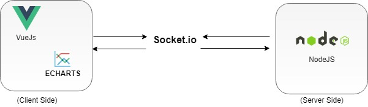
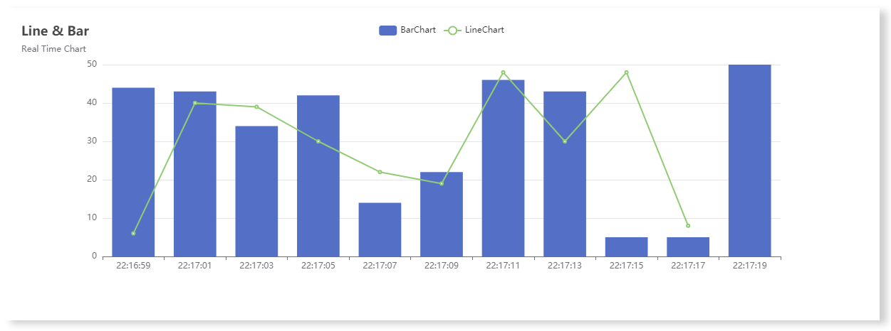

# realtime-chart
This code demonstrate real time data on chart using VueJs as Front-End and NodeJS as backend. For chart I have used Echarts which is free and easy to integrate with VueJS.
This chart shows real data with time interval of 2 sec . And to remove loading issue , used socket.io which builds tunnel between server and client and provide data without any refresh.

## Project Architecture


## Project After being deployed on localhost:8080


## Project setup
Clone repository on your local and then run the below command which will install all the dependencies required for the project. Mostly dependies are built-in libraries nothing out of the box is installed as such.
```
npm install
```
Ones dependencies are installed , run below command to run the client server (Vue JS)
### Complie and deploy client server (Vue JS)
```
npm run serve
```
Ones cient server is deployed successfully , open another terminal in the same directory and run the below command to start the Backend Server (NodeJs)
### Compiles and run the Backend Server (NodeJs)
```
node server
```

### Project is now deployed and can be access on below port
```
http://localhost:8080/
```
### Chart Data on the WebPage


### Customize configuration
See [Configuration Reference](https://cli.vuejs.org/config/).
